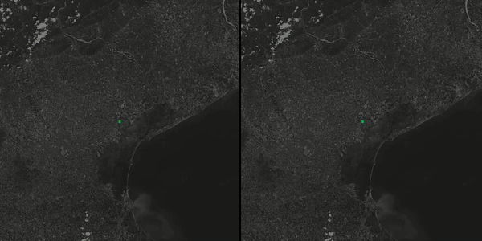

# PhiNet EuroSat Sentinel-2 classification

Implementation of PhiNet for Sentinel-2 patch classification.

Speed comparison between Phinet (right) and resnet50 (left):




## Installation

```pip install -r requirements.txt```

## Usage

```python train.py --net_name 'a050_zero_7_9_10' --epochs 50 --zero_channels 7 9 10```